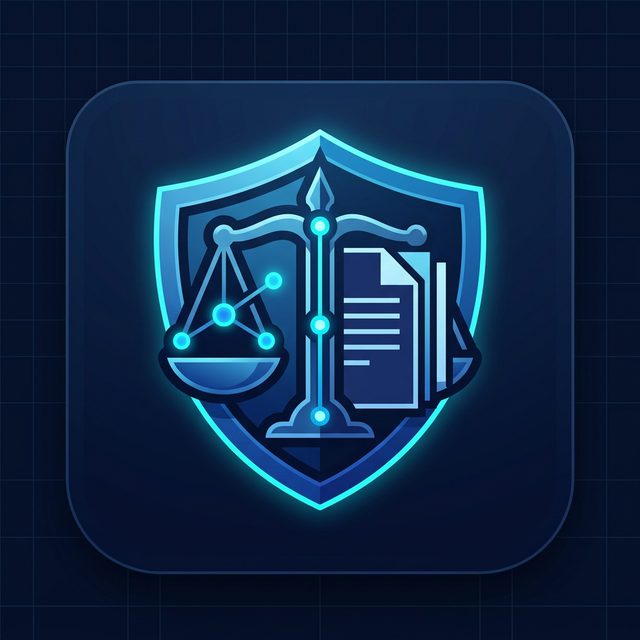

  

# ⚖️ Lex2Control

> **From NIS2 regulatory text to NIST-aligned compliance controls and GRC questions.**

Lex2Control is a notebook-based pipeline designed to bridge the gap between abstract legal frameworks and actionable cybersecurity controls. It translates the **NIS2 Directive** into technical **NIST SP 800-53** controls and generates Governance, Risk, and Compliance (GRC) assessment questions.

---

## ✨ Key Features

The pipeline automates the following steps:
1. 📄 **Extraction & Cleaning**: Processes NIS2 requirements and NIST SP 800-53 controls.
2. ⚙️ **Technical Filtering**: Isolates technical requirements from purely administrative ones.
3. 🔗 **Semantic Mapping**: Maps NIS2 requirements to relevant NIST controls (using advanced semantic matching).
4. ❓ **GRC Generation**: Automatically drafts GRC-style assessment questions.
5. 📊 **Score Estimation**: Estimates a compliance score based on questionnaire answers.

---

## 🏗️ Canonical Pipeline

The repository keeps Jupyter notebooks as the main execution interface. The expected environment for GPU-backed model inference is **Google Colab**.

The operational phases must be executed in the following order:

1. 📓 `Phase 1_ NIST Rule Extraction.ipynb`
2. 📓 `Phase 2_ NIS2 Rule Extraction.ipynb`
3. 📓 `Phase 3_ NIS2-NIST Semantic Matching.ipynb`
4. 📓 `Phase 4_ GRC Question Generator.ipynb`
5. 📓 `Phase 5_ Evaluation.ipynb`
6. 📓 `Phase 6_ Testing.ipynb`

> **Note:** The final, recommended matching strategy is **semantic matching**. The *syntactic / SVO matching* flow is retained as a baseline and for exploratory comparison.

---

## 📁 Repository Structure

- `README.md`: You are here! Overview and execution order.
- `docs/pipeline.md`: Deep dive into the canonical pipeline, inputs/outputs, and known issues.
- `requirements.txt`: Base Python dependencies for local runs or Colab sessions.
- `tools/refactor_notebooks.py`: Helper script to normalize notebook structure.
- `*.ipynb`: The core operational phases of the pipeline.

---

## 📄 Canonical Data Artifacts

Throughout the execution, the pipeline produces and relies on several key files (ignored by Git to keep the repo clean):

### NIST Artifacts
- `sp800-53r5-control-catalog.xlsx`
- `nist_controls_cleaned.csv`
- `nist_controls_svo_v2.csv` (and `_with_family.csv`)

### NIS2 Artifacts
- `nis2_directive.html`
- `nis2_requirements_html.csv`
- `nis2_requirements_cleaned.csv`
- `nis2_only_technical_mpnet.csv`

### Outputs & Results
- `nis2_nist_semantic_matches.csv`
- `matched_control_ids.csv`
- `nist_controls_questions_refined_v2.csv`
- `nist_controls_questions_answers.csv`
- `nis2_compliance_results.csv`

---

## 🚀 Running on Colab

If you are running the project on Google Colab, please stick to these minimal operating rules:

1. **Open** the notebook corresponding to the phase you want to run.
2. **Execute** the dependency cell (`!pip install ...`) first.
3. **Verify** the required inputs and produced outputs for that phase.
4. **Organise**: Keep canonical outputs strictly separate from exploratory notebook variants.

---

## ⚠️ Current Limitations

- **Architecture**: The project is currently notebook-driven rather than package-driven.
- **Validation**: Several methodological choices require stronger formal validation.
- **Evaluation**: There is no labeled "gold standard" yet for evaluating the mapping accuracy.
- **Maturity**: Some phases remain prototypical; the outputs should be used as *decision-support tools* and not as fully automated verdicts. 

---

  <i>Developed as a thesis project.</i>

